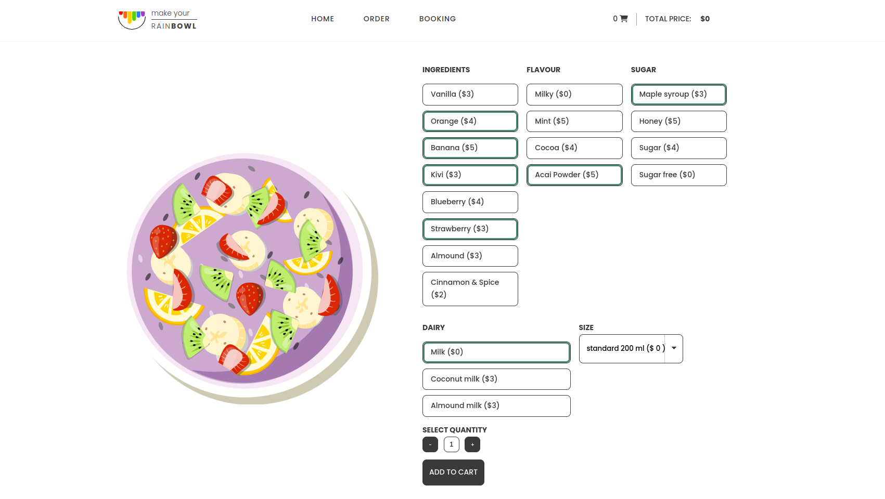
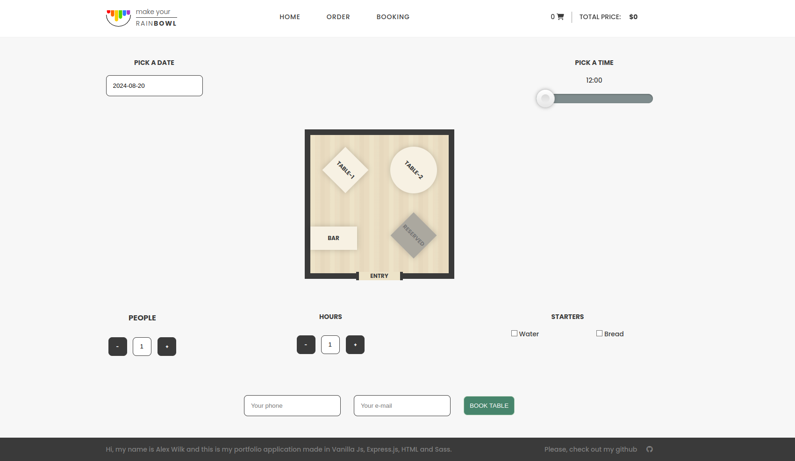

# 🍉  Reinbowl: app for odred meals and booking tables

This project is a fully custom-designed website for the 'Rainbowl' restaurant, specializing in healthy and delicious meals like oatmeal, soups, and puddings. The website was entirely hand-coded using vanilla JavaScript with a strong emphasis on object-oriented programming. All HTML and SCSS files were created from scratch. The design, graphics, and overall aesthetics were carefully crafted to provide a modern, clean, and responsive user experience.

[](https://rainbowl-ollawilk.vercel.app/#/home) 
**[Click here to view the live site](https://rainbowl-ollawilk.vercel.app/#/home)**


## 🍒  Technologies


## 🍏  Key Features:

**1. Custom Design and Graphics**

* All graphics, icons, and images were designed specifically for this project.
* The entire website design, including layout, color schemes, and typography, was created from scratch, with attention to detail in every aspect.

**2. Methods and Tools in the Project:**

* **BEM Methodology:**  The project uses the BEM methodology combined with SCSS to maintain a clear structure, where the style.scss file imports other .scss files. This approach efficiently organizes styles, using variables, mixins, and nested rules for easier management and customization.
* **Semantic HTML5:** The use of semantic HTML5 elements improves accessibility and SEO, making the site more meaningful for search engines and assistive technologies.
* **JavaScript Organization:** The JavaScript code is divided into components and utilizes class inheritance within the context of Object-Oriented Programming (OOP). This modular approach enhances maintainability, readability, and the overall robustness of the code.
* **Script Configuration:** All configuration data is centralized in the settings.js file, simplifying future development and modifications.
* **Handlebars Templating:** Handlebars templates are extensively used to separate content from presentation logic, allowing for dynamic content rendering and easier management of the HTML structure. In my project, I used Handlebars to dynamically render ingredients in meals, enabling flexible and easy content management based on data.

**3. 🍋 Homepage:**

The homepage features focused on promoting healthy and natural food, with a large, colorful hero section and key service features like online ordering, free delivery, and table booking. It also includes a prominently displayed opening hours section, a customer testimonial, and a gallery showcasing the restaurant's dishes.

* **Carousel for Featured Dishes:** A dynamic carousel showcases the restaurant's featured dishes, allowing for an engaging visual presentation through sliding images and captions.
* **Custom Cards:** The menu items and other sections are displayed using custom-designed cards, providing a consistent and clean layout.

**3. 🍈 Order Page:**

The order page allows users to customize their meals by selecting ingredients, flavors, and other options. It features a clean layout with sections for different menu items, each offering customization options such as ingredients, dairy choices, and portion sizes. Users can adjust quantities and add items to the cart, with prices dynamically updating based on selections.


* **AJAX and API Integration:** The order page incorporates AJAX and API technologies to handle dynamic data fetching and order processing. Initially, the website fetches the list of available products from the server using AJAX. Then, after the user completes their order, the order data is sent back to the server using a POST request. Although this API is for prototyping purposes and lacks security features, it provides a foundation for real-world applications.
  
**❗ Important Note:** Currently, we are using a mock API that is powered by jsonServer. Please note that it may take a moment for the server to start. Initially, the order page might not function properly – once the server is fully loaded, the page will automatically retrieve all necessary data.

* **Form Submission and Order Processing:** The checkout form on the order page has been enhanced to prevent page reloads upon submission. The form data, including the cart contents and user details (address and phone number), are packaged into a payload and sent to the API. The API responds with a unique order ID, confirming that the order was successfully placed.
* **Dynamic Product Management:** The cart on the order page dynamically manages product quantities and options. When a product is added to the cart, it retains its selected options and quantity. The cart automatically recalculates totals as products are added, removed, or their quantities are adjusted.
* **Product Removal and Cart Update:** Users can now remove individual items from the cart. The cart's totals are recalculated to reflect the updated contents, providing an accurate summary of the user's order.

**5. 🥭  Shopping Cart:**

* **Cart Class Implementation:** The Cart class is responsible for the overall functionality of the shopping cart. This includes displaying and hiding the cart, adding and removing products, and calculating the total order price. This class handles the global cart operations, ensuring a smooth user experience.
* **CartProduct Class Implementation:** The CartProduct class manages individual products within the cart. Each instance of this class represents a single product, encapsulating all the relevant data and methods for that product.

**6. 🍇 Booking Page:**

The booking page is designed to allow users to easily reserve a table at the restaurant. The page features an interactive form where users can select a date using a date picker and choose a time with a time slider. The central part of the page displays a layout of the restaurant, showing available and reserved tables, allowing users to pick a specific table for their reservation. Additional options include selecting the number of people, the duration of the reservation (hours), and optional starters such as water and bread. The form also requires users to provide their phone number and email address to complete the reservation. Once all details are filled in, users can click the "Book Table" button to finalize their reservation.


   * **Advanced Table Reservation Form:** A new page for table reservations has been added. This form allows users to select a date and time, view the layout of the restaurant, and choose available tables for reservation.
   * **Date and Time Pickers:** The reservation form includes a date picker and a time slider, both implemented using external plugins. These tools enhance the user experience by providing an intuitive way to select reservation details.
   * **Widget Integration:** The project integrates custom widgets, such as the `DatePicker` and `HourPicker`, which extend a base class and provide specialized functionalities for the reservation form.
   * **Dynamic Table Management:** The reservation system dynamically manages table availability based on selected date and time. This includes handling recurring events that might affect table availability.


## 🍓 Summary 

Creating the "Reinbowl" homepage was an enriching experience that significantly deepened my understanding of web design and development. Not only did I design the entire website from scratch, but I also tackled the challenge of learning to navigate and utilize documentation for the first time. This was particularly important when working with Bootstrap and SCSS, where understanding the tools and resources available was crucial for creating a unique and functional website.

This project reinforced the importance of thoroughly understanding the underlying principles of frameworks and how to modify and extend them to suit specific needs. It also highlighted the value of designing custom graphics and layouts, which greatly enhanced the website's visual appeal and user experience.


## 🍐  Installation and Launch

**Clone the project:**

 ```bash
git clone https://github.com/OllaWilk/rainbowl-app-for-order-meals-and-booking-tables.git
```

**Go to the project directory:**

 ```bash
cd rainbowl-app-for-order-meals-and-booking-tables
```

**Install dependencies:**

 ```bash
npm install
```

**Start the server:**

 ```bash
npm run watch
```


**🫐 Limitations and Future Enhancements:**

The current implementation is a prototype and is not intended for production use. The API used lacks security features, such as data encryption and user authentication. Additionally, the system does not support advanced features like user account management, order history, or payment processing.

Potential improvements include adding validation for the checkout form, creating an admin panel for order management, and refining the cart's user interface to enhance usability and accessibility. The reservation system could also be expanded with features like table size management, real-time updates, and enhanced event handling.

## 🍇 TO DO

* add rwd
* Backend aplication in NestJS

